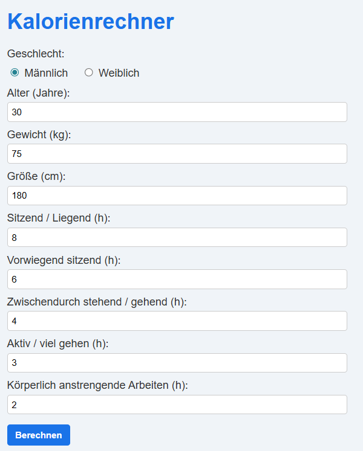
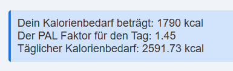

# ITL 1-2 Kalorienrechner

Author: Leonie Rüger
LBS Eibiswald | 3aAPC

## kalorienrechner.php

Erstmal die HTML Grundlage erstellen lassen und eine Überschrift hinzugefügt sowie den Seiten Titel bearbeitet

Dann wurde ein Formular erstellt bei welchen alle gewollten daten abgefragt werden (Geschlecht, Alter, Gewicht, Größe) und dann habe ich gleich dafür den PHP Code geschrieben.

Wenn am Formular auf "Berechnet" gedrückt wird wird das im PHP Code erkannt und alle Eingegeben Daten werden in ausgelesen mit $_POST und in variablen gespeichert. In Dder Funktion calculateKalorienbedarf werden die gebrauchten Variablen mit geschickt so das es berechnet werden kann.

Ich habe dann einfach das Formular mit den anderen Feldern erweitert und auch geschaut das die Variablen dafür gespeichert werden. In der Funktion calculatePAL werden nun die neuen Variablen mitgeschickt und dann um die schlafenszeit zu berechnen einfach 24 (Stunden) - alle anderen Zeiten zusammen. Der Rest wurde wie bei der Aufgabenstellung angegeben berechnet

Und die Ausgabe wurde einfach mit einen Echo mit einen Div gemacht

Der Style wurde größten teils von ChatGPT erstell welches ich jedoch etwas bearbeitet habe

## Öffnen

Einfach nachdem XAMPP mit Apache und MySQL an sind einfach "http://localhost/ITL1-2_Kalorienrechner/kalorienrechner.php" im Browser einfügen

## Screenshots

